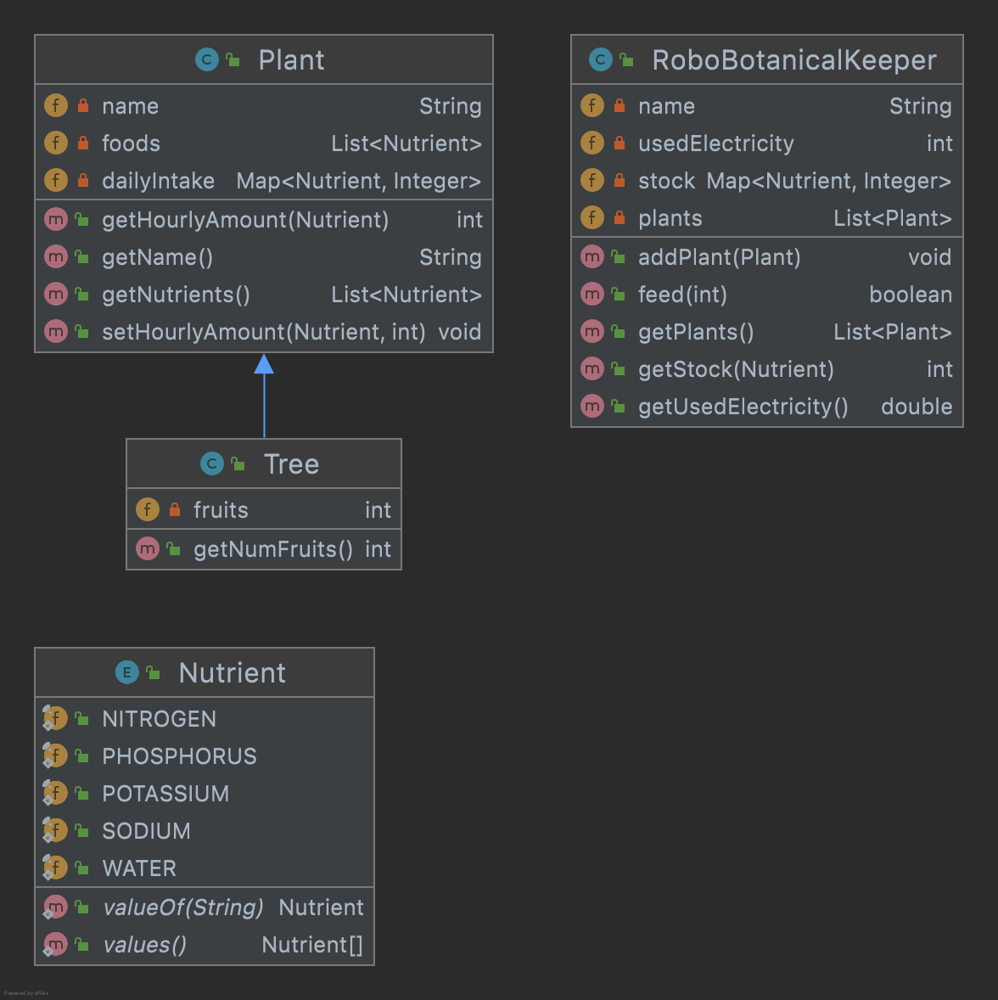

# Robo BotanicalKeeper
We model a Robo BotanicalKeeper able to feed different plants in a Zoo.

First we have the enum `Nutrient`, which defines several food types the plants can eat. This enum is already in the project.   

### 1. class Plant
Implement class `Plant` that has a name, a list of food, and a daily amount to eat (mapping with some amount for each food in the list). 
All amounts are considered to be in grams. 
The constructor only receives the plant name and list of food; the constructor will set the amounts on 0 for all foods in the list. 

The daily intake is defined using a `setHourlyAmount(Ingredient, int)` which will be used to set the amount for each food after construction.
The getter `getHourlyAmount(Ingredient)` should return 0 if the food is not part of the recipe.

### 2. class Tree
`Tree` is a kind of `Plant` that can give birth to other plants. 

Add the method `getNumFruits()` which returns the number of fruits this `Tree` will produce. This is received as third argument to the constructor. 

### 3. Class RoboBotanicalKeeper
This class will handle the feeding process. It must have a model (name), a list of `Plant` objects, and a mapping representing the stock of foods. Additionally, it keeps track of the electricity used to feed the plants (pump nutrients and water).
The feeding/pumping system uses 10 W for each unit of nutrient that needs to be pumped. 

The constructor will receive the model (name) and the battery capacity. New plants will be added using the `addPlant(Plant)` method. The stock will be initialized having 5000 for all possible foods.  

### 4. Feeding 
Implement method `boolean feed(int x)` which feeds the plant at position x.
The method has the following behaviour:
- checks if the plant is tree. if true, each 100 fruits will double the amount of nutrients each tree needs.
- checks if the computed nutrient amounts are available in stock
- if the above conditions are true, then the plant is fed by updating the stock and adding the used electricity.  
- otherwise, the function returns false
